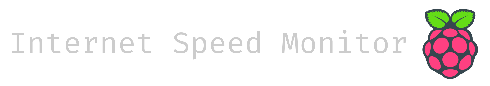
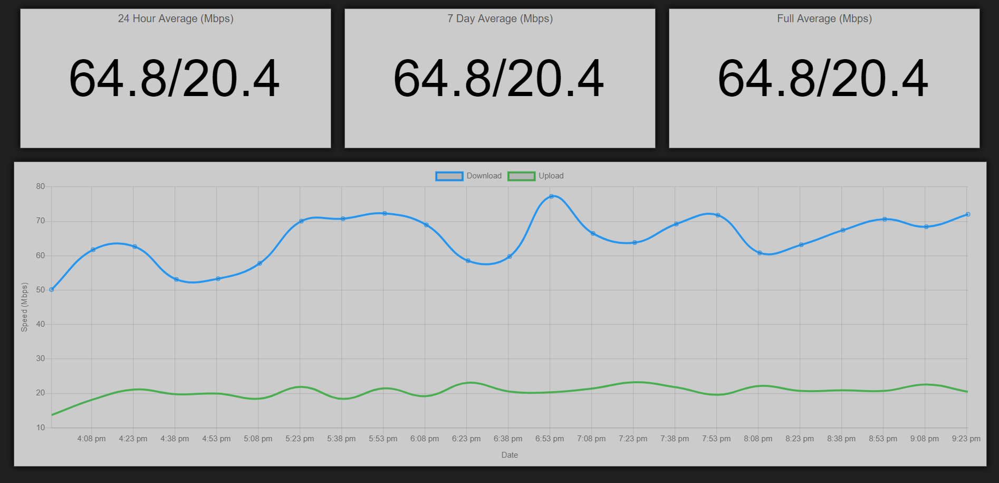

**..:: THIS PAGE IS CURRENTLY A WORK IN PROGRESS! ::..**



[](https://www.codacy.com/app/brianhoward/internet-speed-monitor?utm_source=github.com&amp;utm_medium=referral&amp;utm_content=brianhoward/internet-speed-monitor&amp;utm_campaign=Badge_Grade)

This internet speed monitoring application is used to track the download and upload speed, in Mbps, of the internet of which the computer is connected to, tested every X minutes utilizing the [speedtest.net](https://speedtest.net) API. This application is intended to run continually on a [Raspberry Pi](https://www.raspberrypi.org/). However, it can be run on another operating system or computer as long as it meets all the requirements outlined in the sections below.



# Requirements

The following are required to be installed before the installation and setup of this application.

| Name          | Description                                                                                                                                        | Link                                                                 |
| ------------- | -------------------------------------------------------------------------------------------------------------------------------------------------- | -------------------------------------------------------------------- |
| Python        | Python 2.* or 3.* is required to run speedtest-cli. While the Raspberry Pi, as well as most Linux operating systems, include Python pre-installed. | [python.org](https://www.python.org/)                                |
| speedtest-cli | speedtest-cli is a package for Python to run internet speed tests within the terminal via the speedtest.net API.                                   | [Github/sivel/speedtest-cli](https://github.com/sivel/speedtest-cli) |
| Node.js       | Node.js is use to run this application.                                                                                                            | [nodejs.org](https://nodejs.org/)                                    |

# Optional Requirements

| Name | Description                                                                                                                                                                               | Link                                           |
| ---- | ----------------------------------------------------------------------------------------------------------------------------------------------------------------------------------------- | ---------------------------------------------- |
| PM2  | PM2 is process manager for Node.js allowing for multiple Node.js applications to be easily run on a single computer as well as automatically starting applicants on boot of the computer. | [pm2.keymetrics.io](http://pm2.keymetrics.io/) |
| Yarn | Yarn is a third-party package manager for Node.js that operates much like NPM.                                                                                                            | [yarnpkg.com](https://yarnpkg.com/)            |

# Instillation

Once this application has been downloaded from its Git repository, run the following command in its root directory to install the necessary Node.js packages.

`npm install`
or
`yarn`

# Setup

No setup is required for this application to run.

# Running

To start this application, run the following command in its root directory.

`npm start`
or
`yarn start`

The user interface may be accessed from _http://[IP ADDRESS]:3000_ where _[IP ADDRESS]_ is the IP address of the computer this application is running on.

# Feature List

**TO BE WRITTEN**

# Changelog

| Version | Updates & Changes |
| ------- | ----------------- |
| 1.0.0   | Initial release   |

# Known Issues

Currently, there are no known issues with this application.

# Future Updates & Features

- Better smoothing algorithm for chart
- Dynamic chart resolution based on chart's width
- Auto updating

# Settings

**TO BE WRITTEN**

# Files

**TO BE WRITTEN**

The following files are available pre-run

| File / Directory                 | Usage                                               |
| -------------------------------- | --------------------------------------------------- |
| ./.gitignore                     | List of files to ignore when committing to git.     |
| ./app.js                         | \_\_\_                                              |
| ./CHANGELOG.md                   | Log of changes to this application.                 |
| ./CONTRIBUTING.md                | Information about contributing to this application. |
| ./LICENSE.md                     | Application License.                                |
| ./package.json                   | Node.js packages and application meta data.         |
| ./README.md                      | This file...                                        |
| ./run.js                         | \_\_\_                                              |
| ./public/                        | Folder containing publicly available files.         |
| ./public/index.html              | \_\_\_                                              |
| ./public/javascript.js           | \_\_\_                                              |
| ./public/stylesheet.css          | \_\_\_                                              |
| ./public/database/               | \_\_\_                                              |
| ./public/database/.gitignore     | List of files to ignore when committing to git.     |
| ./public/lib/                    | Folder containing third party libraries.            |
| ./public/lib/axios.js            | \_\_\_                                              |
| ./public/lib/chart.js            | \_\_\_                                              |
| ./public/lib/moment.js           | \_\_\_                                              |
| ./README_FILES/                  | Folder containing images use in README.md.          |
| ./README_FILES/screencapture.png | \_\_\_                                              |
| ./README_FILES/title_image.png   | \_\_\_                                              |

The following files are generated post-run

| File / Directory                     | Usage                                                  |
| ------------------------------------ | ------------------------------------------------------ |
| ./public/database/speedTestData.json | Database in JSON format containing speed test results. |

# File Tree
```
./
│   .gitignore
│   app.js
│   CHANGELOG.md
│   CONTRIBUTING.md
│   LICENSE.md
│   package.json
│   README.md
│   run.js
│
├───public
│   │   index.html
│   │   javascript.js
│   │   stylesheet.css
│   │
│   ├───database
│   │       .gitignore
│   │
│   └───lib
│           axios.js
│           chart.js
│           moment.js
│
└───README_FILES
        screencapture.png
        title_image.png
```

# Contributing

Please feel free to open issues for bugs you've found or features you think are missing. If you would like to contribute to this open source project, submit a pull requests to this repository for merge consideration.

# FAQ

Currently, there is no FAQ items to go here. If you have a question, please open an issue.

# License

This software is licensed under GNU Affero General Public License v3.0. All third party software, code, scripts, services, APIs, content, intellectual property, and other such material (the "I.P.") developed and owned by their respective third parties are not associated with this software and/or project and their associated owners, developers, business, and/or associates. The I.P. are used and distributed in this software and/or project under their respected license. The registration of this software and/or project in no way modifies, changes, or limits the licensing of the third party I.P. used.

**GNU Affero General Public License v3.0**

_Permissions of this strongest copyleft license are conditioned on making available complete source code of licensed works and modifications, which include larger works using a licensed work, under the same license. Copyright and license notices must be preserved. Contributors provide an express grant of patent rights. When a modified version is used to provide a service over a network, the complete source code of the modified version must be made available._

| Permissions      | Limitations  | Conditions                     |
| ---------------- | ------------ | ------------------------------ |
| ✔ Commercial use | ❌ Liability | ❗ License and copyright notice |
| ✔ Modification   | ❌ Warranty  | ❗ State changes                |
| ✔ Distribution   |              | ❗ Disclose source              |
| ✔ Patent use     |              | ❗ Network use is distribution  |
| ✔ Private use    |              | ❗ Same license                 |
                              
# Third Party I.P.

**TO BE WRITTEN**

The following third-party software, code, scripts, services, APIs, content, intellectual property, and other such material (the "I.P.") are used in this software and / or project and are in no way associated with the production, development, or maintenance of this software and/or project. The owners, developers, business, and/or associates of this software and/or project are not endorsing the use of the following software and/or services and are providing the list for reference purposes only.

| Owner(s)                                                                    | I.P.                                                    | Usage                                                                  | License |
| --------------------------------------------------------------------------- | ------------------------------------------------------- | ---------------------------------------------------------------------- | ------- |
| Node.js Foundation / Joyent / Google                                        | [Node.js](https://nodejs.org)                           | This project runs on Node.js and uses some built in Node.js libraries. | \_\_\_  |
| Python Software Foundation                                                  | [Python](https://www.python.org/)                       | Python is used to run the speedtest-cli package.                       | \_\_\_  |
| Axios                                                                       | [Axios](https://github.com/axios/axios)                 | \_\_\_                                                                 | \_\_\_  |
| Chart.js                                                                    | [Chart.js](https://www.chartjs.org/)                    | \_\_\_                                                                 | \_\_\_  |
| Moment.js                                                                   | [Moment.js](https://momentjs.com/)                      | \_\_\_                                                                 | \_\_\_  |
| Matt Martz (Sivel)                                                          | [speedtest-cli](https://github.com/sivel/speedtest-cli) | \_\_\_                                                                 | \_\_\_  |
| Node.js Foundation / StrongLoop, IBM, and other Express contributors | [Express](https://expressjs.com/)                       | \_\_\_                                                                 | \_\_\_  |

# Developed Using

This software and/or project was originally developed using the following software and/or services. The owners, developers, business, and/or associates of this software and/or project are not endorsing the use of the following software and/or services and are providing the list for informational purposes only.

| Software / Service                                                                               | Company   | Usage            |
| ------------------------------------------------------------------------------------------------ | --------- | ---------------- |
| [WebStorm](https://www.jetbrains.com/webstorm/)                                                  | JetBrains | Main IDE         |
| [Atom](https://atom.io/)                                                                         | GitHub    | IDE              |
| [Dell XPS 15](https://www.dell.com/en-us/shop/dell-laptops/xps-15-laptop/spd/xps-15-9570-laptop) | Dell      | Laptop computer  |
| [Intel NUC NUC8i7HVK](https://simplynuc.com/8i7hvk-full/)                                        | Intel     | Desktop computer |

## About Author & Contract

Information about the author and contact information is currently unavailable.

`README.md last updated Aug. 2, 2019`