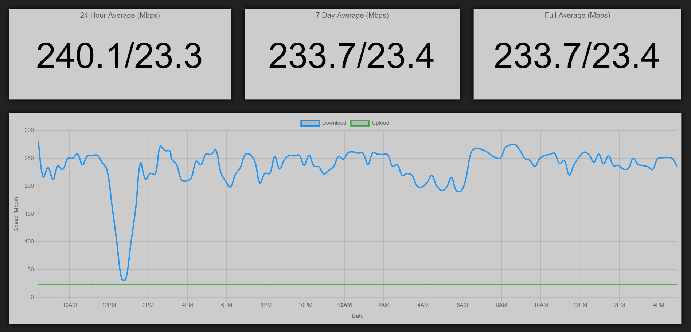

**APP CURRENTLY A WORK IN PROGRESS! PLEASE CHECK BACK LATER...**

Internet speed test application for tracking internet speeds over time utilizing a Raspberry Pi.

# Required Libraries

## speedtest-cli

# Optional Requirements

## PM2

## Yarn

# Instillation

# Setup

# Third Party Libraries Used